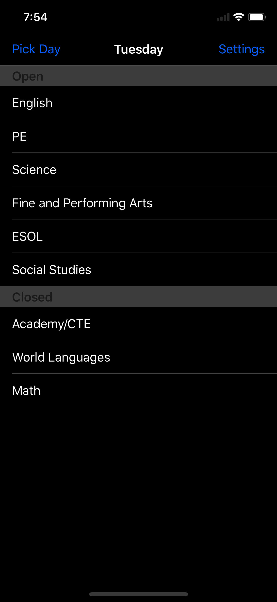
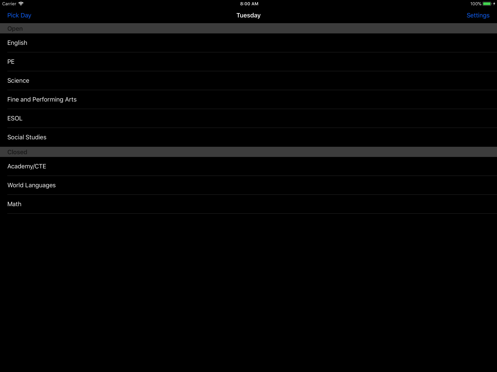
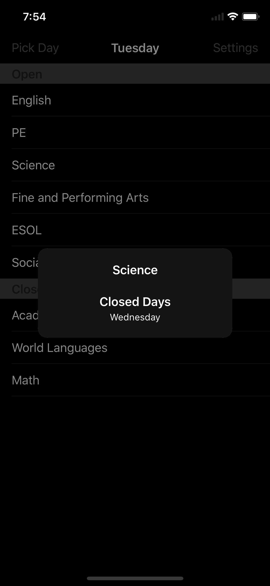
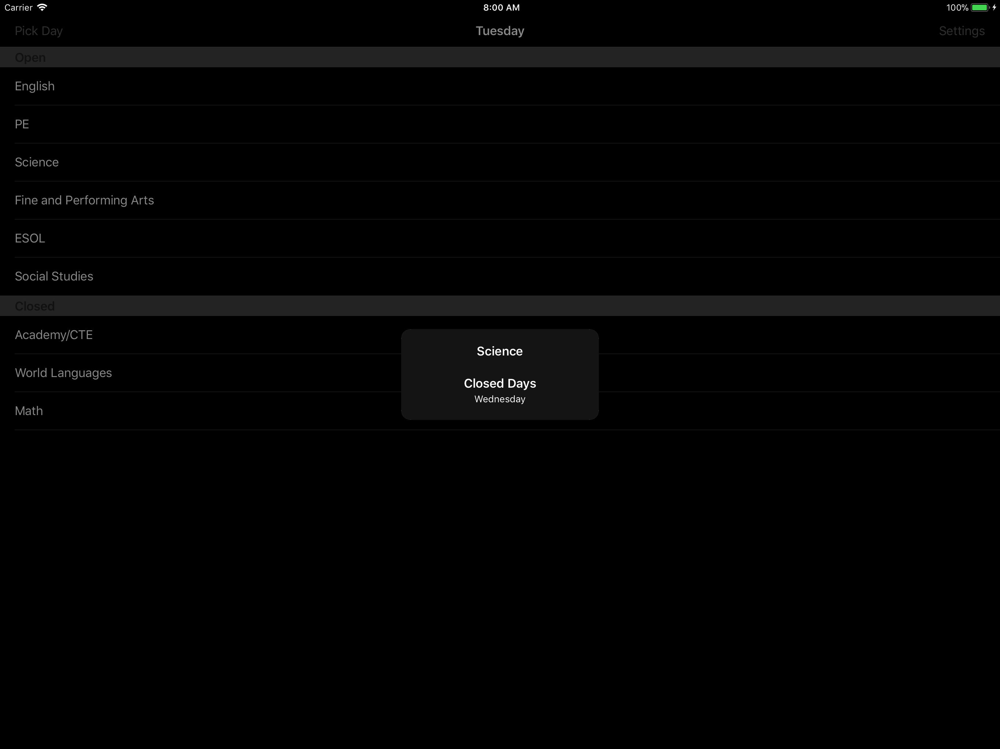
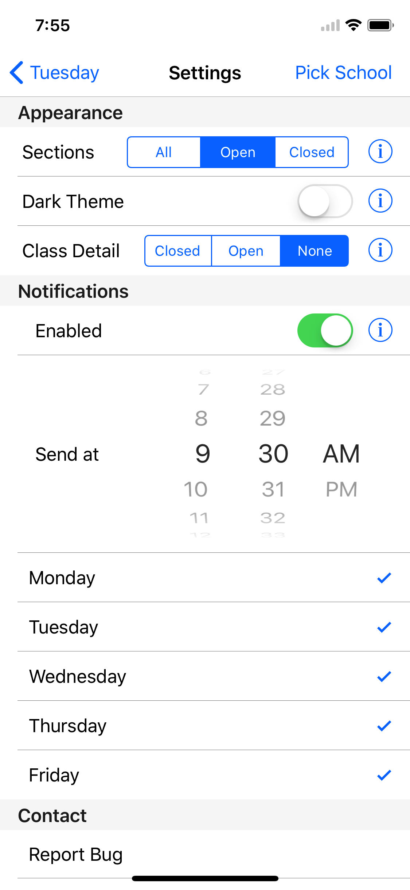
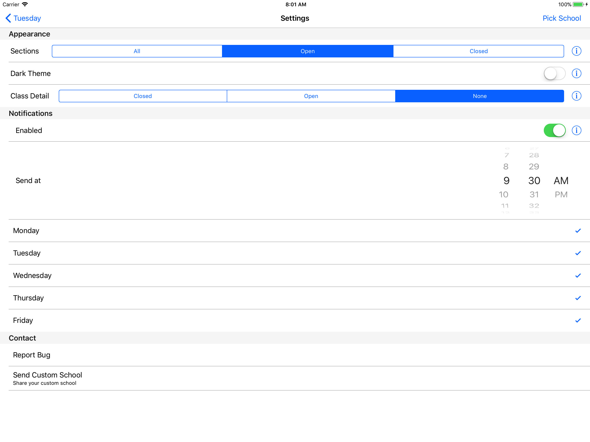
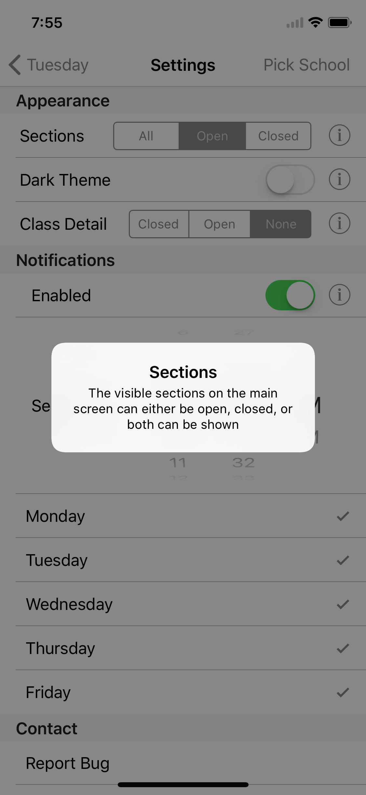
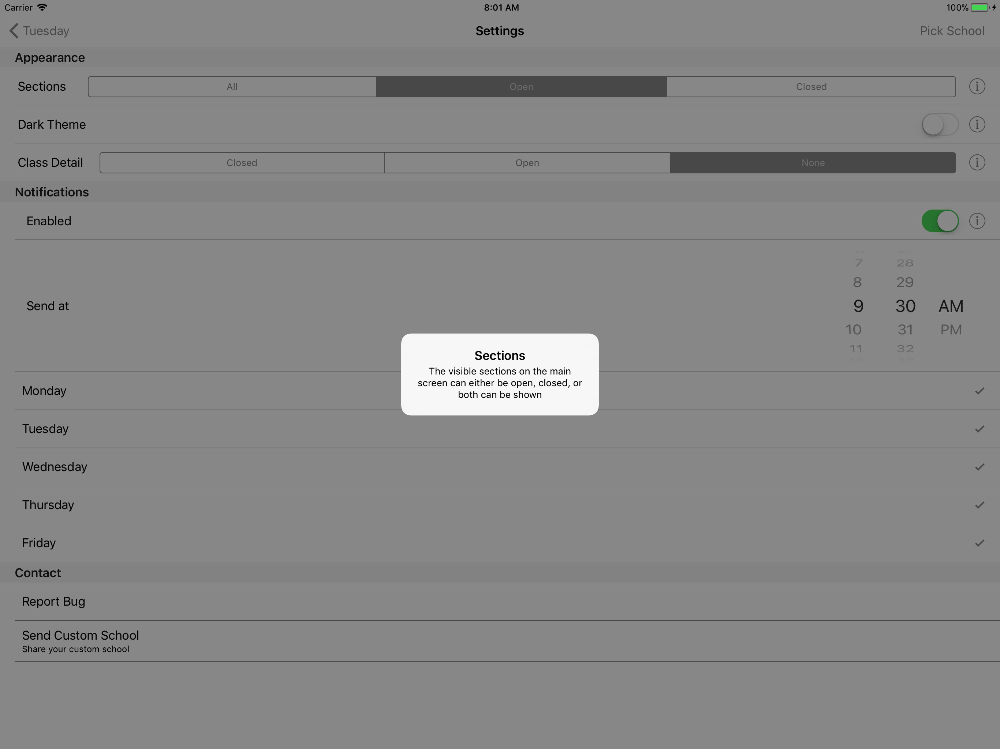
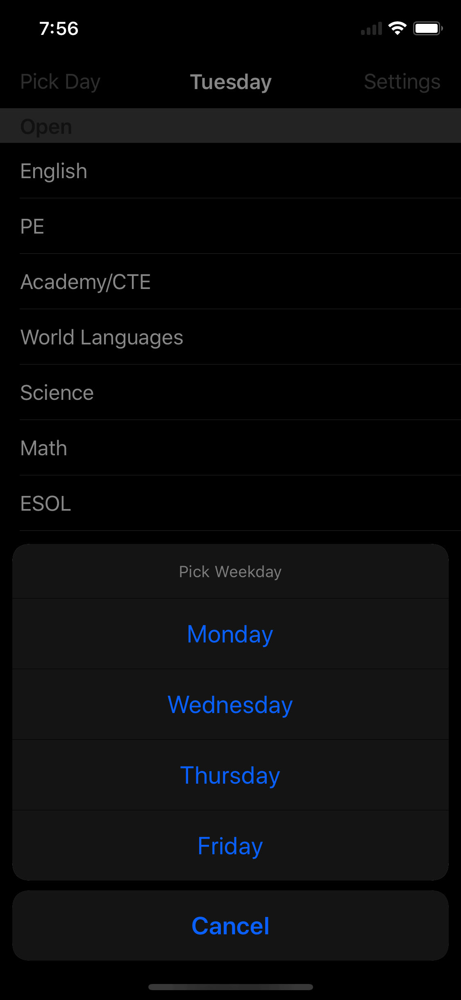
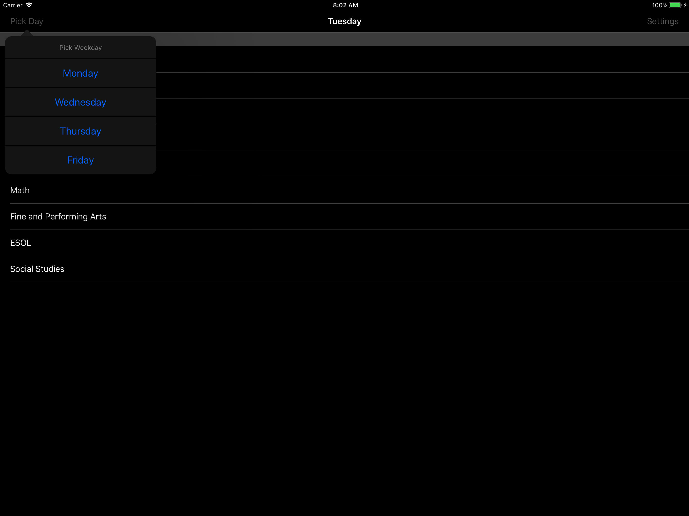

## LearnDay

LearnDay is an iOS app for students with on-off study periods. 

The school district I attended high school in, had a schedule for each department, where each day of the week, some departments were not availible to students during study period. I wrote this app to help my friends and I keep track of that schedule.

### Disclaimer

I decided to open source this, as I was going through my *old* projects. I haven't touched this code since around November 2017. I ran my updated clang-format over all the code before pushing, however the architecture of the project is very primative. Individual bits of code are probably good to look at, however there are parts of this projects that might be bad practice.

### Screenshots

